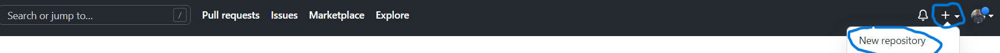
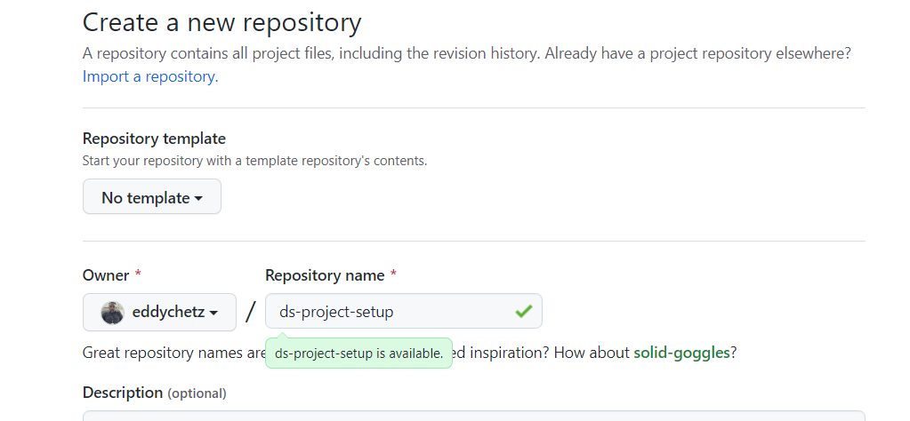
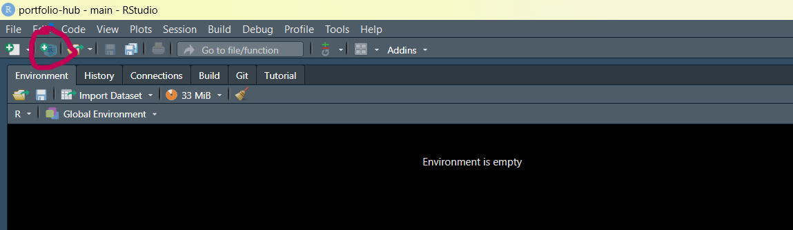
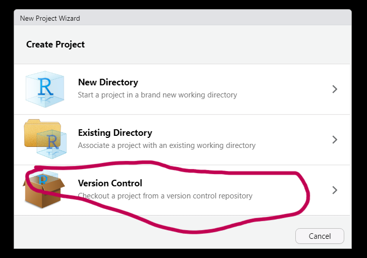
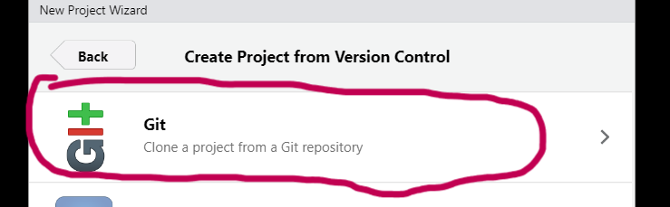
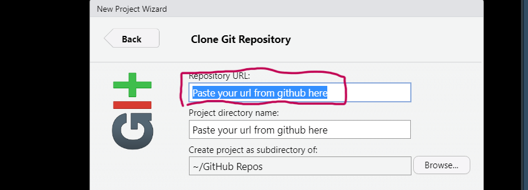

---
authors:
- admin
categories:
- R

date: "2020-12-13T00:00:00Z"
draft: false
featured: false
image:
  caption: 'Image credit: [**Unsplash**](https://unsplash.com/photos/CpkOjOcXdUY)'
  focal_point: ""
  placement: 2
  preview_only: false
lastmod: "2020-12-13T00:00:00Z"
projects: []
subtitle: "Welcome \U0001F44B I know that first impressions are important, so I've
  populated this post with content to help you get familiar with everything about `Create Project from Version Control`."
summary: "Welcome \U0001F44B I know that first impressions are important, so I've
  populated this post with content to help you get familiar with everything  about **Create Project from Version Control**"
tags:
- Academic
- Rstudio
- Github
- R

title: Project Setup from Version Control in R. 
---

``` r
print('Welcome to my first post!')
```

## Overview

This post helps to walk you through the entire process of R project setup on Github and Rstudio IDE. Enjoy the reading!!

## Get Started

### Section :one:: R + Rstudio IDE installation.
You need to download [R](https://cran.mirror.ac.za/bin/windows/) and [Rstudio/Posit](https://posit.co/downloads/).

### Section :two:: Create a new github repository for your project.

How to create a new github repository....

Step :one:: Create a [github](https://github.com/) account if you are a first time user or [login](https://github.com/login) into your existing account.




Step :two:: Give a name to your repository, in this case, `ds-project-setup`.


### Section :three:: Create a new project in R.

Step :one:: Create a new project in Rstudio...


Step :two:: On the **New Project Wizard**, choose `Version Control`.


Step :three:: Select `Git` to create project from version control...


Step :four:: On the `Repository URL:`, paste your url from new github repository you created from step :two: section :one:...


### Section :four:: Familiarize yourself with your Rstudio IDE.

## License

Copyright 2022-present [Eddwin Cheteni](https://teaching-portfolio-site.netlify.app).
