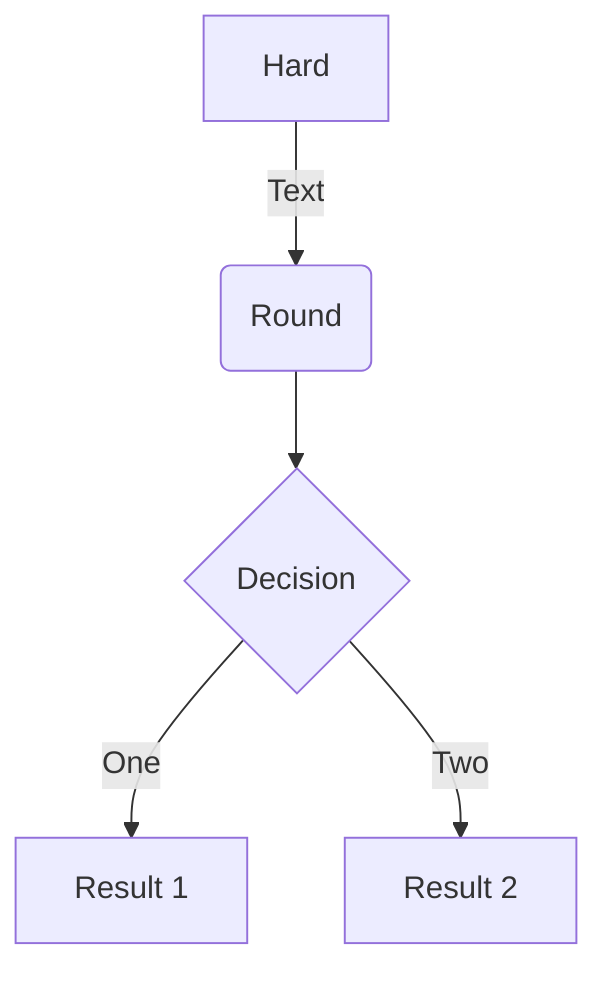
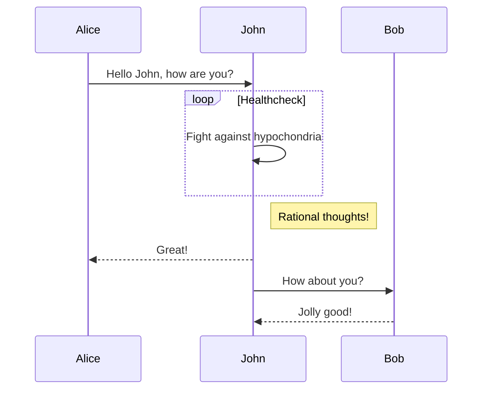
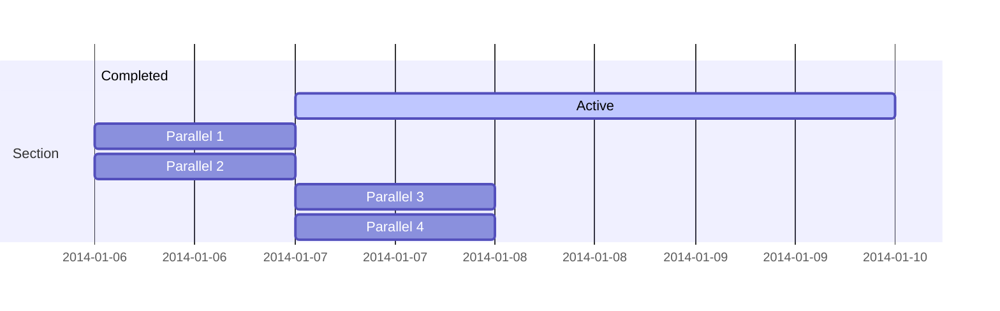
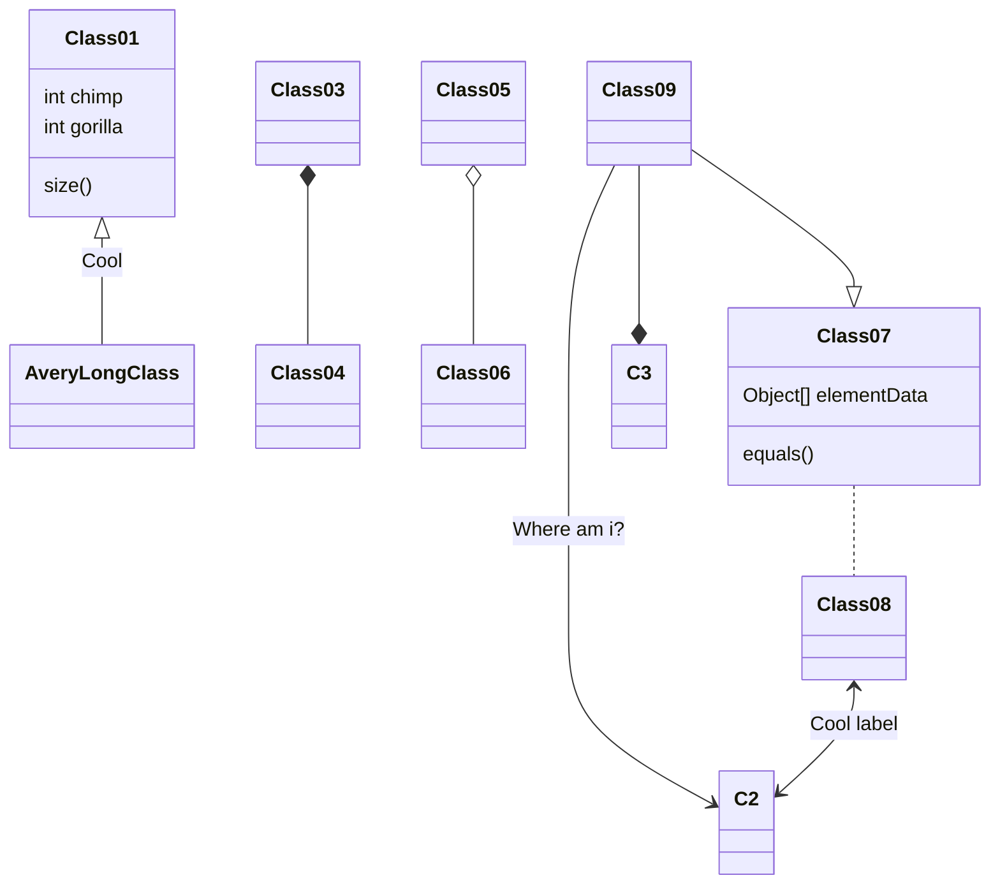
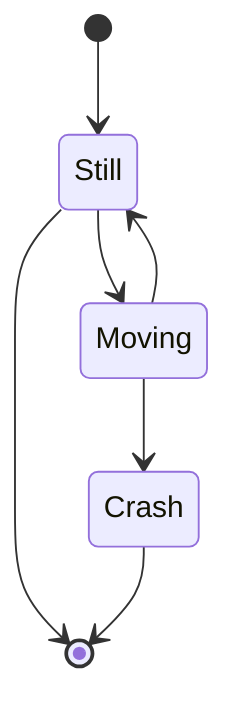

It is very interesting that nowadays, some individuals and organisations
had come to realize the power of numbers when organised in some way to
give the **BIG PICTURE** of historical events to keep track of what
happened, knowing the root causes and effects of the situation and
enriched data-driven corrective actions position the business on a
reduced-uncertainty space.

``` mermaid
stateDiagram
[*] --> Business_Understanding
Business_Understanding --> Data_Understanding
Data_Understanding --> Business_Understanding
Data_Preparation --> Modeling
Data_Understanding --> Data_Preparation
Modeling --> Data_Preparation
Modeling --> Evaluation
Evaluation --> Business_Understanding
Evaluation --> Deployment
Deployment --> :end:
```
```` markmap
- __BUSINESS SCIENCE WORKFLOW__
  - BUSINESS UNDERSTANDING
    - Understand strategic goals
    - Understand customer needs
    - Audience specification
    - Define KPIs
    - Data requirements
  - __DATA UNDERSTANDING__
    - Import Data
    - Describe Data
    - Explore Data
    - Check Data Quality
    
  - DATA PREPARATION
    - Variable Selection
    - Recast Data
    - Clean Data
    - Feature engineering
    - Combine Datasets
  - EXPERIMENTATION
    - Baseline
    - Parameter tuning
    - Performance evaluation
  - COMMUNICATE RESULTS
    - Reporting with `rmarkdown`
    - Distribution with `shiny` Apps
````

Business science capabilities combined with computing knowledge, can add
value to business when given adequate attention to it and result from
observing the data patterns, and able to forecast future trends. This
article will give you the glimpse of the business process in general and
hoping that this information will also adds value to your knowledge
bank.

The following are essential steps a team or an individual needs to take
when using business science;

# Steps

{} Step :one:: Data Preparation {}

Every business organisation, from energy, retail, finance, agriculture,
medicine and education, rapidly generates data about the events taking
place during and after business hours. The data generated can be online
transactions, sensor readings, energy usage, stock price, wearable
device readings, employees' information from the HR department, and so
on. These raw facts are kept in some file type (could be .csv, .tsv,
.xlsx file), served locally, on a database or on the web that will
require an API to connect to the data source. It requires different
methods to access a specific dataset. The most basic approach is when
accessing data stored locally, whereby you're required to import it to
your IDE's workstation ( *Rstudio*).

R have great libraries that you can use to access data. Below code
illustrates how to achieve the goal of accessing data locally or from a
SharePoint.

``` r
# tidyverse library includes: readr for reading .csv or .tsv file formats.
library(tidyverse) 

# Read `CSV` file following the `filepath` defined below.
filepath = "your-data-location-path/data.csv"

# Read CSV file into a `tibble` named `data` to be stored on your working 
# directory.
data <- read_csv(filepath)

# View data properties using `glimpse` from `dplyr` helping you with a 
# detailed info about your tabular data. You're able to know the column 
# names, the shape and data type of each column.
glimpse(data)
```

rendered as

```{r}
library(tidyverse)
```

{} **Step 2**: Exploratory Data Analysis
{}

{} **Step 3**: Model Development {}

{} **Step 4**: Distribution {}

**Highlight your code snippets, take notes on math classes, and draw
diagrams from textual representation.**

On this page, you'll find some examples of the types of technical
content that can be rendered with Wowchemy.

## Examples

### Code

Wowchemy supports a Markdown extension for highlighting code syntax. You
can customize the styles under the `syntax_highlighter` option in your
`config/_default/params.yaml` file.

    ```python
    import pandas as pd
    data = pd.read_csv("data.csv")
    data.head()
    ```

renders as

``` python
import pandas as pd
data = pd.read_csv("data.csv")
data.head()
```

### Mindmaps

Wowchemy supports a Markdown extension for mindmaps.

Simply insert a Markdown `markmap` code block and optionally set the
height of the mindmap as shown in the example below.

A simple mindmap defined as a Markdown list:

<div class="highlight">
<pre class="chroma">
<code>
```markmap {height="200px"}
- Hugo Modules
  - wowchemy
  - wowchemy-plugins-netlify
  - wowchemy-plugins-netlify-cms
  - wowchemy-plugins-reveal
```
</code>
</pre>
</div>

renders as

`markmap {height="200px"} - Hugo Modules   - wowchemy   - wowchemy-plugins-netlify   - wowchemy-plugins-netlify-cms   - wowchemy-plugins-reveal`

A more advanced mindmap with formatting, code blocks, and math:

<div class="highlight">
<pre class="chroma">
<code>
```markmap
- Mindmaps
  - Links
    - [Wowchemy Docs](https://wowchemy.com/docs/)
    - [Discord Community](https://discord.gg/z8wNYzb)
    - [GitHub](https://github.com/wowchemy/wowchemy-hugo-themes)
  - Features
    - Markdown formatting
    - **inline** ~~text~~ *styles*
    - multiline
      text
    - `inline code`
    -
      ```js
      console.log('hello');
      console.log('code block');
      ```
    - Math: $x = {-b \pm \sqrt{b^2-4ac} \over 2a}$
```
</code>
</pre>
</div>

renders as

```` markmap
- Mindmaps
  - Links
    - [Wowchemy Docs](https://wowchemy.com/docs/)
    - [Discord Community](https://discord.gg/z8wNYzb)
    - [GitHub](https://github.com/wowchemy/wowchemy-hugo-themes)
  - Features
    - Markdown formatting
    - **inline** ~~text~~ *styles*
    - multiline
      text
    - `inline code`
    -
      ```js
      console.log('hello');
      console.log('code block');
      ```
    - Math: $x = {-b \pm \sqrt{b^2-4ac} \over 2a}$
````

### Charts

Wowchemy supports the popular [Plotly](https://plot.ly/) format for
interactive charts.

Save your Plotly JSON in your page folder, for example
`line-chart.json`, and then add the
`` shortcode where you would like the
chart to appear.

Demo:



You might also find the [Plotly JSON
Editor](http://plotly-json-editor.getforge.io/) useful.

### Math

Wowchemy supports a Markdown extension for $\LaTeX$ math. You can enable
this feature by toggling the `math` option in your
`config/_default/params.yaml` file.

To render *inline* or *block* math, wrap your LaTeX math with
`$...$` or
`$$...$$`, respectively. (We wrap the
LaTeX math in the Wowchemy *math* shortcode to prevent Hugo rendering
our math as Markdown. The *math* shortcode is new in v5.5-dev.)

Example **math block**:

``` latex

$$
\gamma_{n} = \frac{ \left | \left (\mathbf x_{n} - \mathbf x_{n-1} \right )^T \left [\nabla F (\mathbf x_{n}) - \nabla F (\mathbf x_{n-1}) \right ] \right |}{\left \|\nabla F(\mathbf{x}_{n}) - \nabla F(\mathbf{x}_{n-1}) \right \|^2}
$$

```

renders as


$$\gamma_{n} = \frac{ \left | \left (\mathbf x_{n} - \mathbf x_{n-1} \right )^T \left [\nabla F (\mathbf x_{n}) - \nabla F (\mathbf x_{n-1}) \right ] \right |}{\left \|\nabla F(\mathbf{x}_{n}) - \nabla F(\mathbf{x}_{n-1}) \right \|^2}$$


Example **inline math**
`$\nabla F(\mathbf{x}_{n})$` renders as
$\nabla F(\mathbf{x}_{n})$.

Example **multi-line math** using the math linebreak (`\\`):

``` latex

$$f(k;p_{0}^{*}) = \begin{cases}p_{0}^{*} & \text{if }k=1, \\
1-p_{0}^{*} & \text{if }k=0.\end{cases}$$

```

renders as



$$
f(k;p_{0}^{*}) = \begin{cases}p_{0}^{*} & \text{if }k=1, \\
1-p_{0}^{*} & \text{if }k=0.\end{cases}
$$



### Diagrams

Wowchemy supports a Markdown extension for diagrams. You can enable this
feature by toggling the `diagram` option in your
`config/_default/params.toml` file or by adding `diagram: true` to your
page front matter.

An example **flowchart**:

    ```mermaid
    graph TD
    A[Hard] -->|Text| B(Round)
    B --> C{Decision}
    C -->|One| D[Result 1]
    C -->|Two| E[Result 2]
    ```

renders as



An example **sequence diagram**:

    ```mermaid
    sequenceDiagram
    Alice->>John: Hello John, how are you?
    loop Healthcheck
        John->>John: Fight against hypochondria
    end
    Note right of John: Rational thoughts!
    John-->>Alice: Great!
    John->>Bob: How about you?
    Bob-->>John: Jolly good!
    ```

renders as



An example **Gantt diagram**:

    ```mermaid
    gantt
    section Section
    Completed :done,    des1, 2014-01-06,2014-01-08
    Active        :active,  des2, 2014-01-07, 3d
    Parallel 1   :         des3, after des1, 1d
    Parallel 2   :         des4, after des1, 1d
    Parallel 3   :         des5, after des3, 1d
    Parallel 4   :         des6, after des4, 1d
    ```

renders as



An example **class diagram**:

    ```mermaid
    classDiagram
    Class01 <|-- AveryLongClass : Cool
    Class03 *-- Class04
    Class05 o-- Class06
    Class07 .. Class08
    Class09 --> C2 : Where am i?
    Class09 --* C3
    Class09 --|> Class07
    Class07 : equals()
    Class07 : Object[] elementData
    Class01 : size()
    Class01 : int chimp
    Class01 : int gorilla
    Class08 <--> C2: Cool label
    ```

renders as



An example **state diagram**:

    ```mermaid
    stateDiagram
    [*] --> Still
    Still --> [*]
    Still --> Moving
    Moving --> Still
    Moving --> Crash
    Crash --> [*]
    ```

renders as



### Todo lists

You can even write your todo lists in Markdown too:

``` markdown
- [x] Write math example
  - [x] Write diagram example
- [ ] Do something else
```

renders as

-   [x] Write math example
    -   [x] Write diagram example
-   [ ] Do something else

### Tables

Save your spreadsheet as a CSV file in your page's folder and then
render it by adding the *Table* shortcode to your page:

# 

# `go #  #`

renders as



### Callouts

Academic supports a [shortcode for
callouts](https://wowchemy.com/docs/content/writing-markdown-latex/#callouts),
also referred to as *asides*, *hints*, or *alerts*. By wrapping a
paragraph in `{} ... {}`, it
will render as an aside.

``` markdown
{}
A Markdown aside is useful for displaying notices, hints, or definitions to your readers.
{}
```

renders as

{} A Markdown aside is useful for displaying notices,
hints, or definitions to your readers. {}

### Spoilers

Add a spoiler to a page to reveal text, such as an answer to a question,
after a button is clicked.

``` markdown

You found me!

```

renders as

 You found me! 

### Icons

Academic enables you to use a wide range of [icons from *Font Awesome*
and
*Academicons*](https://wowchemy.com/docs/getting-started/page-builder/#icons)
in addition to
[emojis](https://wowchemy.com/docs/content/writing-markdown-latex/#emojis).

Here are some examples using the `icon` shortcode to render icons:

``` markdown
 Terminal  
 Python  
 R
```

renders as

 Terminal  Python  R

### Did you find this page helpful? Consider sharing it 🙌
