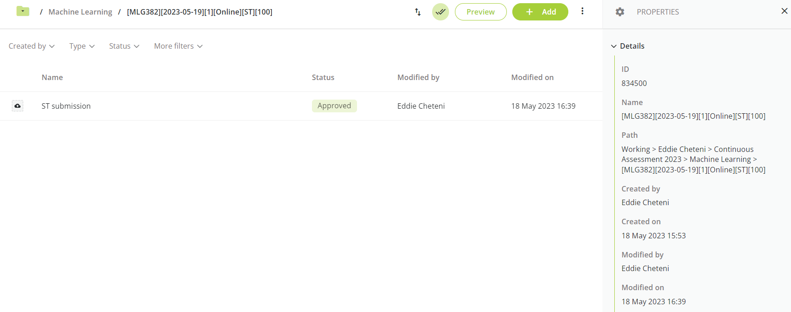
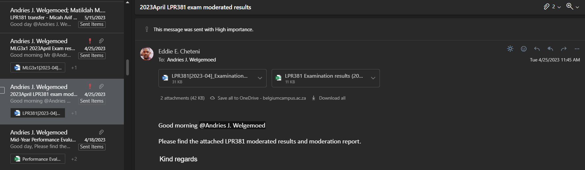

## Performance Evaluation

[Eddie Cheteni](/#about/)\| [Presentation 2023](https://wowchemy.com/docs/content/slides/)

------------------------------------------------------------------------

### Outline


    :arrow_right: Lecture preparation and innovation,

    :arrow_right: Student/lecturer evaluation.
    



    :arrow_right: Lecture preparation and innovation.

    :arrow_right: Student/lecturer evaluation.
    



    :arrow_right: Academic development, :arrow_right: Professional development and, 
    :arrow_right: Skills development.



    :arrow_right: AIT supervision.



    :arrow_forward: Moderation management, :arrow_forward: Deadline adherance, 
    :arrow_forward: Class management and preparation, :arrow_forward: Subject file updates,
    :arrow_forward: Extra-curricular engagement.


------------------------------------------------------------------------

# :one: Improve Student Learning Experience 

------------------------------------------------------------------------

## Lecture Preparation & Innovation

:arrow_forward: Preparations are done in advance, before the subject or course commences. 

------------------------------------------------------------------------

## Lecture Preparation & Innovation

:arrow_forward: Prepared lesson plan. 

------------------------------------------------------------------------

## Lecture Preparation & Innovation

:arrow_forward: Tests Preparations

------------------------------------------------------------------------

## Lecture Preparation & Innovation

:arrow_forward: Use of **Class Notebook** for students to engage in an active teaching and learning experience where the lecturer can trace progress in their work.

------------------------------------------------------------------------

## Student Satisfaction

:arrow_forward:  Use of **Reflect** tab from **Teams** to gather students' reviews. 

------------------------------------------------------------------------

## Graduant Success Rate

:arrow_forward: One of my students based in Kempton Park Campus graduated this year 2023. 

 {height=50%}

------------------------------------------------------------------------

# :two: Continuous Curricula Development

------------------------------------------------------------------------

## Research of Future Curricula

:arrow_forward: Project-based learning to improve ways of teaching [machine learning in R](https://business-science-practice.netlify.app/).

 {height=75%}

------------------------------------------------------------------------

## Continuous Contribution to Module Development

:arrow_forward: Making sure that order of learning outcomes are well-organised for better teaching and improved student understanding.

------------------------------------------------------------------------

## Continuous Contribution to Module Development

:arrow_forward: Provide students with valuable skill in machine learning through web application and that is an add-on to their resume.

[Example of a deployed Live Shiny Application](https://ml-ai-hub-applications.shinyapps.io/bike-sales-app/)

------------------------------------------------------------------------

# :three: Faculty Staff Development

------------------------------------------------------------------------

## Faculty Staff Development

:white_check_mark: Assisted cluster chairs with quicker ways to clean results sheet from AssessmentQ.

------------------------------------------------------------------------

## Academic Development

:white_check_mark: UNISA - PhD application in process.

------------------------------------------------------------------------

## Skills & Professional Development

:white_check_mark: Microsoft Certifications

------------------------------------------------------------------------

## Skills & Professional Development

:white_check_mark: Microsoft Certified: Azure Data Scientist Associate

------------------------------------------------------------------------

## Skills & Professional Development

:white_check_mark: Microsoft Certified: Power BI Data Analyst Associate

------------------------------------------------------------------------

## Teaching Portfolio

:white_check_mark: Created a website to facet all the information about my teaching career journey [work in progress](/#portfolio/)

------------------------------------------------------------------------

# :four: Increase Faculty Research and Innovation 

------------------------------------------------------------------------

## DST Supervision

:white_check_mark:  Teams meetings conducted at weekly and asynchronously.

------------------------------------------------------------------------

## DST Supervision

:white_check_mark:  Communication with students checking their progress and providing feedback.

------------------------------------------------------------------------

# :five: Faculty Quality Assurance 

------------------------------------------------------------------------

## Overview

:white_check_mark: In order to improve quality of assessments and results, below are suggested inputs towards the achievement of cluster goals.

------------------------------------------------------------------------

## Moderation Management

:white_check_mark: Moderation of Examinations and Assessments

------------------------------------------------------------------------

## Moderation Management

:white_check_mark: Moderation of Students' Examination Scripts.

------------------------------------------------------------------------

## Deadline Adherance

:white_check_mark: Meeting deadlines (submitting marks a week after an assessment is written)

:warning: Few hurdles as the assessments are done on AQ that delays the submission. (Final assessment was written on the 27th of March and the marks were in on the 4th of April - still within the acceptable time-frame)

------------------------------------------------------------------------

## Class Management and Preps

:white_check_mark: Sitting arrangement, students to sit closer to front row for improved concentration. :warning: Few challenges faced when some PCs are not working properly.

:white_check_mark: Making sure the venue is accessible in time (5-10mins before).

:white_check_mark: Good aeration in classroom for F2F students.

------------------------------------------------------------------------

## Subject File Updates

:white_check_mark: MLG382 files updated continuously.

------------------------------------------------------------------------

## Extra Curricular Engagement

:white_check_mark: Part-time classes.

------------------------------------------------------------------------

## Extra Curricular Engagement

:white_check_mark: Participating in BRICS Courses Standardization. 

------------------------------------------------------------------------

## Extra Curricular Engagement

:white_check_mark: Initiated a Power BI project to generate insights from data - [Work In Progress](https://github.com/eddychetz/BC-Insight-Engine/blob/main/Getting%20Started.md).

------------------------------------------------------------------------

## Future Plans

## Next Academic Year Goals

:one:  Productivity goals
:white_check_mark: To improve students' learning experience using [learners (student) analytics](https://github.com/eddychetz/BC-Insight-Engine/blob/main/Getting%20Started.md) - (**Work In Progress**),

:two: Problem-solving goals
:white_check_mark: To increase student engagement in learning hands-on,
:white_check_mark: [Blog posting](https://base-blog-posts.netlify.app/posts/sales-demand-forecasting/sales-demand-forecasting) and [free virtual training](https://eddiecheteni.netlify.app/post/getting-started/) workshops.

:three: Reporting goals
:white_check_mark: To prepare timely progress reports,

------------------------------------------------------------------------

# Questions?

[Ask](https://discord.gg/z8wNYzb)

[Click to end session](/#about/)
