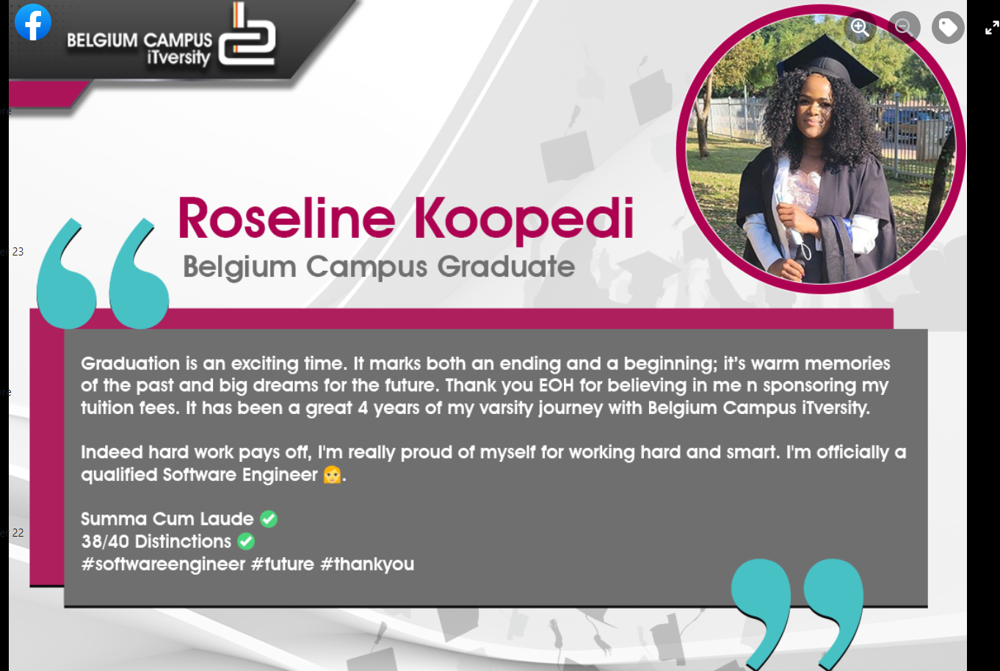

## Performance Review

[Eddie Cheteni](/#about/)\| [Presentation 2022](https://wowchemy.com/docs/content/slides/)

------------------------------------------------------------------------

### Outline


    :arrow_right: Lecture preparation and innovation,

    :arrow_right: Student/lecturer evaluation.



    :arrow_right: Lecture preparation and innovation.

    :arrow_right: Student/lecturer evaluation.
    



    :arrow_right: Academic development, :arrow_right: Professional development and, 
    :arrow_right: Skills development.



    :arrow_right: AIT supervision.



    :arrow_forward: Moderation management, :arrow_forward: Deadline adherance, 
    :arrow_forward: Class management and preparation, :arrow_forward: Subject file updates,
    :arrow_forward: Extra-curricular engagement.


------------------------------------------------------------------------

# :one: Improve Student Learning Experience 

------------------------------------------------------------------------

## Lecture Preparation & Innovation

>:arrow_forward: Preparations are done in advance, before the respective week or course begins. 

------------------------------------------------------------------------

## Lecture Preparation & Innovation

>:arrow_forward: Prepared lesson plan. 

------------------------------------------------------------------------

## Lecture Preparation & Innovation

>:arrow_forward: Tests Preparations

------------------------------------------------------------------------

## Lecture Preparation & Innovation

>:arrow_forward: Use of [**Flipgrid**](https://admin.flipgrid.com/manage/topics/33143996) for students to peer review each other's research assignments.

------------------------------------------------------------------------

## Student Satisfaction

>:arrow_forward:  Use of **Reflect** tab from **Teams** to gather students' reviews. 

------------------------------------------------------------------------

## Graduant Success Rate

:arrow_forward: One of my students based Kempton Park Campus graduated this year 2022. 

------------------------------------------------------------------------

# :two: Continuous Curricula Development

------------------------------------------------------------------------

## Research of Future Curricula

>:arrow_forward: Project-based learning to improve ways of teaching machine learning.

 {height=100%}

------------------------------------------------------------------------

## Continuous Contribution to Module Development

>:arrow_forward: Making sure that order of topics are well-organised for better teaching and improved student understanding 

------------------------------------------------------------------------

# :three: Faculty Staff Development

------------------------------------------------------------------------

## Faculty Staff Development 

> :white_check_mark: Assisted cluster chairs with better ways to disseminate info. to students.

------------------------------------------------------------------------

## Faculty Staff Development

> :white_check_mark: Demostration to colleagues.


------------------------------------------------------------------------

## Academic Development

> :white_medium_small_square: [MScFE - WorldQuant University](https://learn.wqu.edu/my-path)

------------------------------------------------------------------------

## Academic Development

> :white_medium_small_square: [ADSL - WorldQuant University](https://learn.wqu.edu/my-path)

------------------------------------------------------------------------

## Professional Development

> :white_check_mark: AWS Certified Cloud Practitioner

------------------------------------------------------------------------

## Skills Development

> :white_check_mark: [Data Science Virtual Programme](https://www.linkedin.com/in/eddwin-cheteni-profile/recent-activity/)

------------------------------------------------------------------------

## Skills Development

> 
------------------------------------------------------------------------

## Teaching Portfolio

> :white_check_mark: Created a website to facet all the information about my teaching career journey [work in progress](/#portfolio/)

------------------------------------------------------------------------

# :four: Increase Faculty Research and Innovation 

------------------------------------------------------------------------

## AIT Supervision

> :white_check_mark:  Info sessions conducted at least twice each year.

------------------------------------------------------------------------

## AIT Supervision

> :white_check_mark:  Follow Up on students with no submission and others without internship for updates.

------------------------------------------------------------------------

# :five: Faculty Quality Assurance 

------------------------------------------------------------------------

## Moderation Management

> :white_check_mark: Moderation of Examinations and Assessments

------------------------------------------------------------------------

## Moderation Management

> :white_check_mark: Moderation of Students' Examination Scripts.

------------------------------------------------------------------------

## Deadline Adherance

> :white_check_mark: Meeting deadlines (submitting marks a week after an assessment is written)

> :warning: Few hurdles as the assessments are done on AQ that delays the submission.

------------------------------------------------------------------------

## Class Management and Preps

:white_check_mark: Sitting arrangement, students to sit closer to front row for improved concentration.

:white_check_mark: Making sure venue is accessible in time (5-10mins before).

:white_check_mark: Good aeration in the room for F2F students.

------------------------------------------------------------------------

## Extra Curricular Engagement

> :white_check_mark: Part-time classes.

------------------------------------------------------------------------

## Extra Curricular Engagement

> :white_check_mark: Winter school classes. 


------------------------------------------------------------------------

## Extra Curricular Engagement

> :white_check_mark: Bridging course classes.

------------------------------------------------------------------------

## Future Plans

## Next Academic Year Goals

:one:  Productivity goals
:white_check_mark: to increase enrollment using customer(student) analytics,

:two: Problem-solving goals
:white_check_mark: to increase student engagement in learning hands-on,
:white_check_mark: Blog posting and free virtual training workshops.

:three: Reporting goals
:white_check_mark: to prepare timely progress reports,

------------------------------------------------------------------------

# Questions?

[Ask](https://discord.gg/z8wNYzb)

[Click to end session](/#about/)
